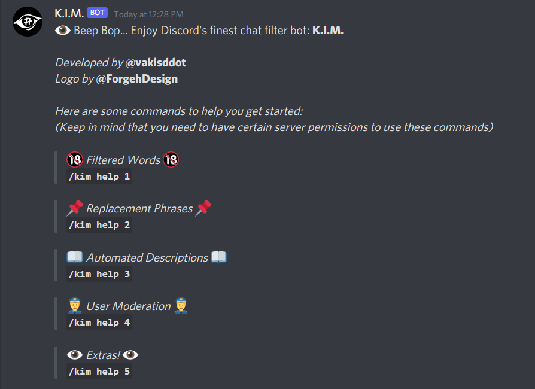

# K.I.M. - Discord Censor Bot
#### Video Demo:  <URL HERE>
#### Description:
  K.I.M. is a Discord anti-profanity bot that will do its best to clean up text messages from users.
  
   
  
  The way that it works is that it reads messages and compares certain parts of the message to words, tagged as profanity in its database. The database is different for each server and moderators or admins can add and remove words at their will. (The bot assumes that users with the "Manage Messages" permissions are mods or admins). K.I.M. uses SQL to read and write to its database.
  
   
  
  The bot has a bunch of commands that can be manipulated for each server, such as:
  - adding or removing "replacement phrases" (a replacement phrase is a phrase that the bot will randomly choose and replace a censored word with)
  - adding or removing descriptions (a description is a piece of text that the bot will spew out whenever a user uses a filtered word, it can be used in a way to poke fun at the users who swear)
  - setting a server swear threshold and punishing users who go over said threshold!
  
  [Add KIM to your server](https://discord.com/oauth2/authorize?client_id=854075604035305542&permissions=10246&scope=bot)

-------------------------------------------------------------------------------------------------------------------------------------------------------------
#### Code Explained:
  
  So the main file that we'll be looking at is "KimBot.py". It basically features a bunch of functions that get executed on certain events. The most important function is "on_message", which reads data about every single text message that gets sent and stores it temporarily in variables in "config.py". It then proceeds to generate a "character map", which basically is a python list that takes every single character from a string and determines if the string contains a "censor" word through an algorithm. If there's at least one "True" character in the map, then the bot has detected a bad word! 
  When a bad word has been detected, the bot will automatically delete the message and replace it with its own, that will contain a description and a reformatted message that will either not feature the censor word(s) or will tag the bad word(s) as a spoiler. Also, if the server keeps track of how many censor words have been used by the users, it will automatically update the database and will give out warnings and punishments if needed.
  The rest of the functions in "KimBot.py" either output data to the user or input data through SQL queries. (or they just help with that)
